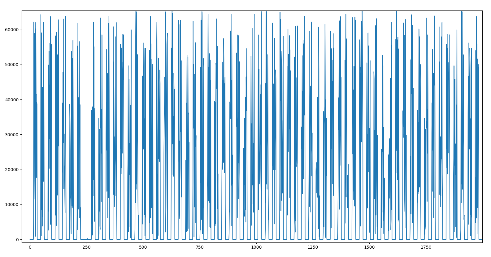
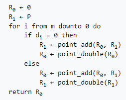
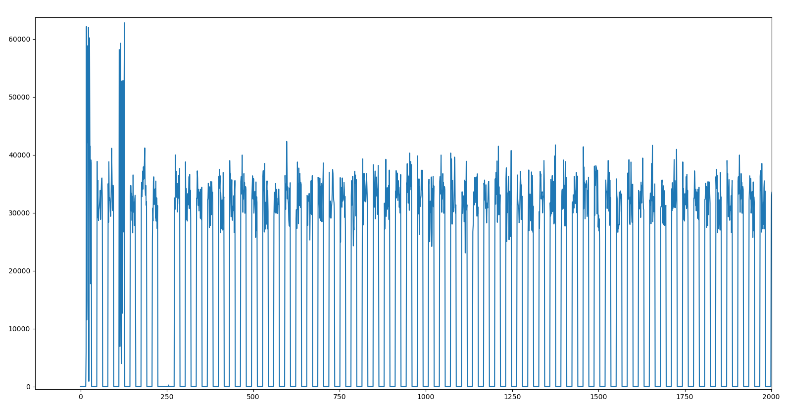
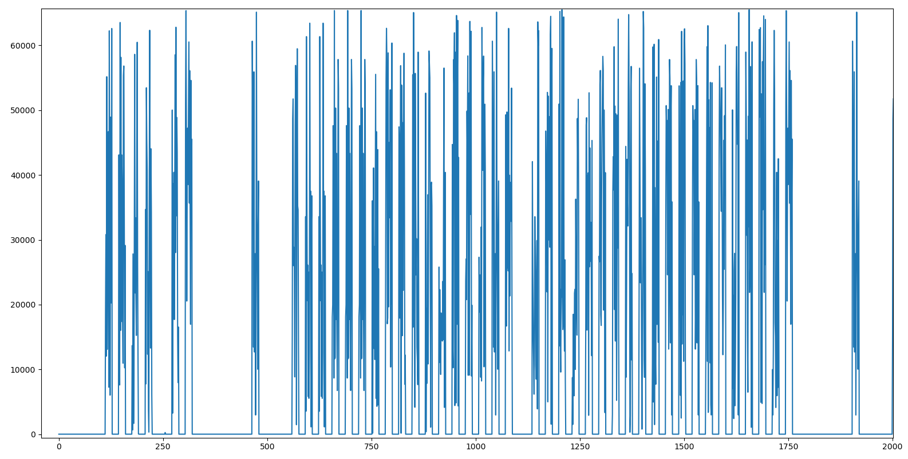

# Fine, fine
```
We hooked an oscilloscope to a chip we found on the floor near the entrance of the Crypto-Party. It executes what looks like the public key computation on secp256r1 from some static secret, but it seems we can specify the input point though...And it's definitely a Montgomery Ladder. That secret in there must give us access to free cryptodrinks, surely?

```
## Initial data
We are provided with the following code:
```python
#!/usr/bin/python3s
import numpy as np
import requests

url = 'http://fine-fine.donjon-ctf.io:6000'

def send_getpubkey(data):
    cmd = {'cmd' : 'getpubkey', 'data': data }
    x = requests.post(url, json = cmd)
    if x.headers["content-type"] == "application/octet-stream":
        trace = np.frombuffer(x.content, dtype=np.uint16)
        return trace
    else:
        return x.json()

if __name__ == "__main__":
    print(send_getpubkey("aa"*64))
    r = send_getpubkey("6b17d1f2e12c4247f8bce6e563a440f277037d812deb33a0f4a13945d898c2964fe342e2fe1a7f9b8ee7eb4a7c0f9e162bce33576b315ececbb6406837bf51f5") # this is secp256r1's basepoint 
```

An API is exposed by the `fine-fine.donjon-ctf.io` server, and returns a power trace of a device apparently computing `k.P`, with `k` an static unknown secret scalar, and `P` an attacker-chosen point on the `secp256r1` curve.

The trace of a random point, let's say the generator `G`, looks like the following:

```python
from matplotlib import pyplot as plt
cv = Curve.get_curve('secp256r1')
n = cv.order
g = cv.generator

def trace_from_point(p):
    return send_getpubkey(bytes(cv.encode_point(p)[1:]).hex())

plt.plot(trace_from_point(g))
plt.show()

```



## Montgomery Ladder

The wording of the challenge mentions the *Montgomery Ladder*: this algorithm is an improvement of the classic "Double-and-Add" method, since it is protected against *Simple Power Analysis*. Indeed, as shown in the algorithm below, the *Montgomery Ladder* carries out the same operations (a point addition and a point doubling operation for each bit of the scalar) during the complete multiplication, independently of the scalar's value.




## Masking operations
If we ask multiple traces for the same operation (*e.g.* `k.G`), and draw the mean value of theses traces at each point in time t, we obtain the following kind of graph: 
```python
traces = list()
for _ in range(30):
    traces.append(trace_from_point(g))
traces = np.array(traces)
plt.plot(traces.mean(axis=0))
plt.show()
```



We can observe that two sets of points seem to have a different mean value from the rest. These points are most likely correlated to the coordinates of the point G (which stays unchanging for every multiplication).
The rest of the values seem to have a mean value of around 32768 (2**15), which is the median value of a `uint16`.

It would thus seems that some randomization mechanism is applied in the computation in order to mask the correlation between the intermediate values that are computed by the algorithm and the power cunsumption.

These randomization strategies aim to protect against *Differential Power Analysis* techniques, and are quickly summarized in the introduction of the paper "[A Refined Power-Analysis Attack on
Elliptic Curve Cryptosystems](https://www.iacr.org/archive/pkc2003/25670199/25670199.pdf)" by *Louis Goubin* (which also gives away the strategy to solve the challenge).


## The vulnerability
As mentionned in the paper quoted above, the three DPA-countermeasures all involve changing the coordinates of the point to be multiplied, in order to perform the multiplication in another coordinate system (such as the Jacobian system), in another elliptic curve or another field; in each case a random element makes the computation unique, and thus "protected" against DPA. 

However, if a point has one of its coordinate equals to zero (in the original curve/field/affine coordinate system), this property stays true when the point is "transformed" by one of the three methods. As a result, the addiction or doubling operation performed on such a point consume less power on average.

If we send such a point to the server, we indeed observe a difference in the power trace:

```python
Z = Point(0, cv.y_recover(0), cv)
plt.plot(trace_from_point(Z))
plt.show()
```


We observe more sets of points that are equal to zero, which corespond to computations performed on points that have one coordinate equals to 0 (which we are going to call `Z`)


## The exploit
We are now able to determine if the point `Z` (for which the X coordinate is 0) is handled at some point in the computation of the *Montgomery Ladder*.

If we submit a point `P` such as there is some known `s` for which `s.P=Z`, and we observe "gaps" in the power traces returned by the server, we thus will know that `k` (the secret) will probably starts with the bits of `s`.

Let's try 128 values for `s` starting with `1`, and mark the number of zeroes in each power traces (which correspond to "gaps" aforementionned):
```python
def zeroes(t):
    return t.tolist().count(0)

# number of zeroes found in a "normal" power trace
min_z = zeroes(trace_from_point(g))

for s in range(1, 129):
    s_inv = pow(s, -1, n) # if s.P=Z, then P=(s^-1).Z
    P = s_inv * Z
    z = zeroes(trace_from_point(P)) - min_z
    print(f"{s=}, {z=}")
```
```
s=1, z=257  <=
s=2, z=98   <=
s=3, z=130  <=
s=4, z=2
s=5, z=48   <=
s=6, z=129  <=
s=7, z=6
s=8, z=1
s=9, z=3
s=10, z=5
s=11, z=51  <=
s=12, z=130 <=
s=13, z=1
[...]
s=22, z=6
s=23, z=131 <=
s=24, z=53  <=
s=25, z=2
[...]
s=45, z=1
s=46, z=132 <=
s=47, z=53  <=
s=48, z=4
[...]
s=91, z=3
s=92, z=129 <=
s=93, z=51  <=
s=94, z=4
[...]
s=128, z=5
```

It seems that high number of zeroes in the traces occur for some pairs of `s` values, : (5,6), (11,12), (23,24), (46,47), (92,93)... 

And we also can empirically observe that the sequence of the first numbers of each pairs (5, 11, 23, 46, 92, ...) follows a simple rule: each number is either *the double* of its predecessor, or *the double plus 1*.

We can thus progressively construct a `s` that will share more and more bits with `k`, and print it during the process to see the flag appear little by little :)

```python
s=1
while s.bit_length() < 256:
    s *= 2
    s_inv = pow(s, -1, n) # if s.P=Z, then P=(s^-1).Z
    P = s_inv * Z
    z = zeroes(trace_from_point(P)) - min_z
    if z < 50//2:
        s += 1
    print(s, s.to_bytes(256//8, "little")[::-1])
```

```
2 b'\x00\x00\x00\x00\x00\x00\x00\x00\x00\x00\x00\x00\x00\x00\x00\x00\x00\x00\x00\x00\x00\x00\x00\x00\x00\x00\x00\x00\x00\x00\x00\x02'
5 b'\x00\x00\x00\x00\x00\x00\x00\x00\x00\x00\x00\x00\x00\x00\x00\x00\x00\x00\x00\x00\x00\x00\x00\x00\x00\x00\x00\x00\x00\x00\x00\x05'
11 b'\x00\x00\x00\x00\x00\x00\x00\x00\x00\x00\x00\x00\x00\x00\x00\x00\x00\x00\x00\x00\x00\x00\x00\x00\x00\x00\x00\x00\x00\x00\x00\x0b'
23 b'\x00\x00\x00\x00\x00\x00\x00\x00\x00\x00\x00\x00\x00\x00\x00\x00\x00\x00\x00\x00\x00\x00\x00\x00\x00\x00\x00\x00\x00\x00\x00\x17'
46 b'\x00\x00\x00\x00\x00\x00\x00\x00\x00\x00\x00\x00\x00\x00\x00\x00\x00\x00\x00\x00\x00\x00\x00\x00\x00\x00\x00\x00\x00\x00\x00.'
92 b'\x00\x00\x00\x00\x00\x00\x00\x00\x00\x00\x00\x00\x00\x00\x00\x00\x00\x00\x00\x00\x00\x00\x00\x00\x00\x00\x00\x00\x00\x00\x00\\'
184 b'\x00\x00\x00\x00\x00\x00\x00\x00\x00\x00\x00\x00\x00\x00\x00\x00\x00\x00\x00\x00\x00\x00\x00\x00\x00\x00\x00\x00\x00\x00\x00\xb8'
369 b'\x00\x00\x00\x00\x00\x00\x00\x00\x00\x00\x00\x00\x00\x00\x00\x00\x00\x00\x00\x00\x00\x00\x00\x00\x00\x00\x00\x00\x00\x00\x01q'
738 b'\x00\x00\x00\x00\x00\x00\x00\x00\x00\x00\x00\x00\x00\x00\x00\x00\x00\x00\x00\x00\x00\x00\x00\x00\x00\x00\x00\x00\x00\x00\x02\xe2'
1476 b'\x00\x00\x00\x00\x00\x00\x00\x00\x00\x00\x00\x00\x00\x00\x00\x00\x00\x00\x00\x00\x00\x00\x00\x00\x00\x00\x00\x00\x00\x00\x05\xc4'
[...]
10436617478697981009077101136567912771579695474699038459121447228382494183023 b'\x17\x12\xea\x89q\x8e\xb8r\xb6hj\x88\xcfh\xed\r\xeen\x8ek\xec-\xcc\x8b\xe8\xed\xee\xacM-\xceo'
20873234957395962018154202273135825543159390949398076918242894456764988366047 b'.%\xd5\x12\xe3\x1dp\xe5l\xd0\xd5\x11\x9e\xd1\xda\x1b\xdc\xdd\x1c\xd7\xd8[\x99\x17\xd1\xdb\xddX\x9a[\x9c\xdf'
41746469914791924036308404546271651086318781898796153836485788913529976732094 b'\\K\xaa%\xc6:\xe1\xca\xd9\xa1\xaa#=\xa3\xb47\xb9\xba9\xaf\xb0\xb72/\xa3\xb7\xba\xb14\xb79\xbe'
83492939829583848072616809092543302172637563797592307672971577827059953464189 b'\xb8\x97TK\x8cu\xc3\x95\xb3CTF{Ghosts_and_Goubins}'```