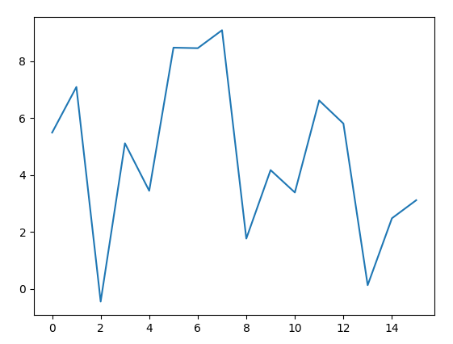
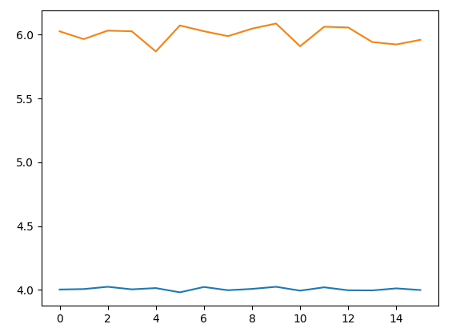
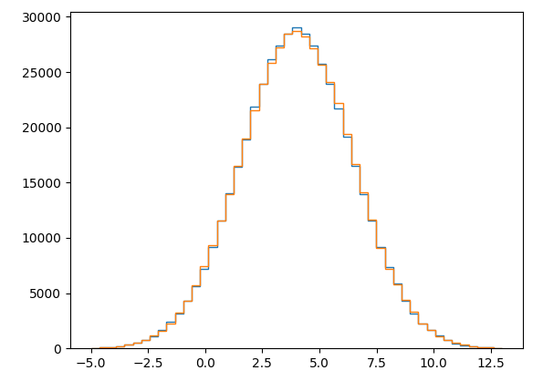
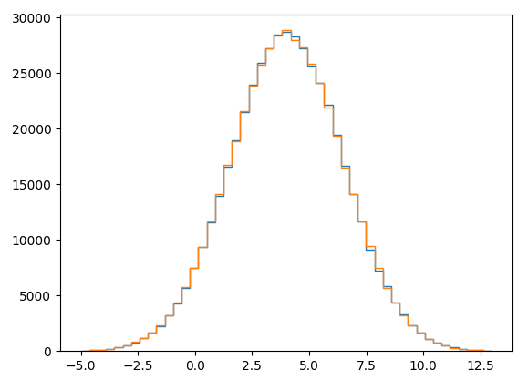
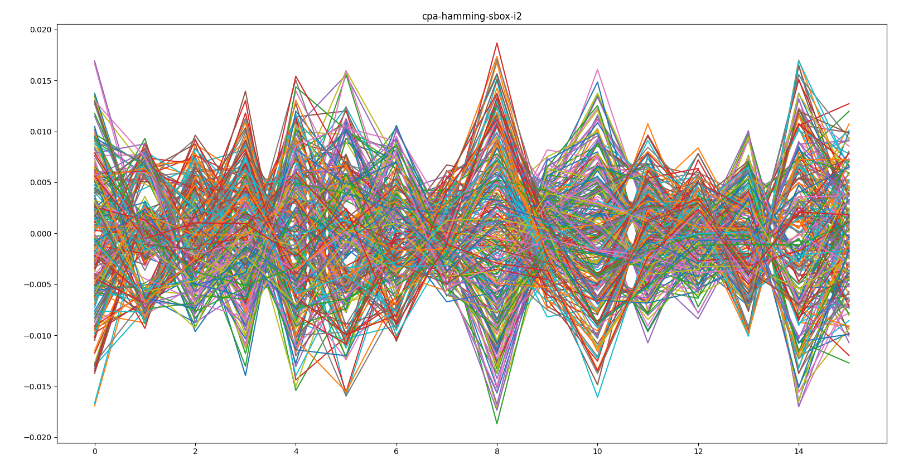
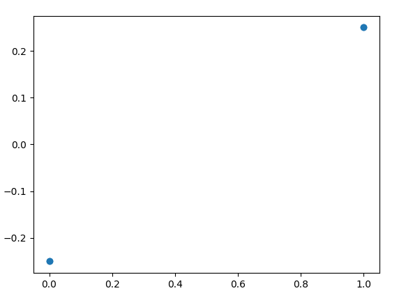
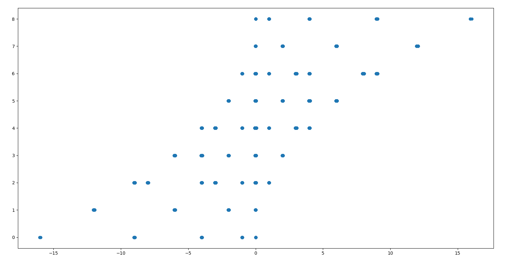

# Masked boot
```
A hardware wallet vendor protects the storage of the user PIN by using firmware encryption.
The encrypted user PIN is stored on an off-chip flash memory.
After dumping the external flash that contains the encrypted PIN, I managed to control the flash contents and register the power consumption during the power up while the flash decryption was performed.
AES-128 algorithm is used inverted in the flash encryption, so the flash encryption "encrypt" operation is AES decrypt and the "decrypt" operation is AES encrypt.

Could you help me to extract the PIN?
```

## Initial data
We are given a `data.h5` file containing the results of a power analysis campaign against the mentionned device, and an encrypted firmware `enc_firmware.bin`.

The firmware is 256 bytes long, so it contains 16 AES "decrypted" blocks.
```
$ hexdump -C enc_firmware.bin
00000000  3e 51 cb 56 c6 e3 a0 43  a1 2e 23 50 47 d0 ea a5  |>Q.V...C..#PG...|
00000010  80 b2 a6 c0 12 c7 f1 92  af 59 a2 6a bf 64 53 65  |.........Y.j.dSe|
00000020  77 1d d7 85 c6 44 34 a1  ad 6a db a4 62 5f 71 0b  |w....D4..j..b_q.|
00000030  b7 af 4d 75 a8 5a 2f 57  b3 8d 9e d3 33 c6 ae b7  |..Mu.Z/W....3...|
00000040  9f 9f 94 7c 70 96 31 a3  d0 7a 3d 4d df ce 22 4b  |...|p.1..z=M.."K|
00000050  ca ca cc 23 53 a2 86 98  36 91 92 c8 89 1b db b5  |...#S...6.......|
*
00000090  3e 30 37 6a b9 8b cf b5  21 93 f3 de a6 bd ae 08  |>07j....!.......|
000000a0  d1 e1 1a 5f 5c c9 a6 82  a5 a9 1b bb 8c 52 4b ca  |..._\........RK.|
000000b0  4a 54 ec bb 0a d4 de f4  21 5d cd cb 1c 8c 09 0b  |JT......!]......|
000000c0  ca ca cc 23 53 a2 86 98  36 91 92 c8 89 1b db b5  |...#S...6.......|
*
00000100
```

Since some blocks are repeating, we can conclude that the ECB mode was used to encrypt data.

Finally, the `data.h5` file contains 30000 power traces recorded during the encryption of given plaintexts. We note that the traces are only 16 points long:

```python
In [1]: import h5py

In [2]: f=h5py.File("./data.h5", "r")

In [3]: f.keys()
Out[3]: <KeysViewHDF5 ['aes']>

In [4]: f["aes"].dtype
Out[4]: dtype([('plaintext', 'u1', (16,)), ('traces', '<f8', (16,))])

In [5]: import numpy as np

In [6]: from matplotlib import pyplot as plt

In [7]: plt.plot(f["aes"]["traces"][0])
Out[7]: [<matplotlib.lines.Line2D at 0x183d0f69fd0>]

In [8]: plt.show()
```



## Statistics
Plotting a few graphs help to make hypothesis on what we are actually looking at.

The mean and the variance for each point in time seem to be constant, and around 4.0 and 6.0 respectively:



For a single point in time (or all points regrouped), the distribution looks like a Gaussian one (of mean 4.0 and variance 6.0, as observed before):

```python
plt.hist(np.random.normal(4.0, np.sqrt(6.0), size=30000*16), bins=np.linspace(-5,13,50), histtype="step")
plt.hist(traces.flatten(), bins=np.linspace(-5,13,50), histtype="step")
plt.show()
```


Pushing the tests a little further, we can even observe that the distribution also matches a normal distribution centered on 0.0 and of standard deviation 2.0, added with the distribution corresponding to the hamming weigth of uniformely distributed random bytes:
```python
def hamming(x):
    n = 0
    while x:
        x &= x-1
        n += 1
    return n

norm = np.random.normal(0.0, 2.0, size=30000*16)
unif = np.random.randint(0, 256, size=30000*16)
hamm = np.vectorize(hamming)

plt.hist(traces.flatten(), bins=np.linspace(-5,13,50), histtype="step")
plt.hist(norm + hamm(unif),  bins=np.linspace(-5,13,50), histtype="step")
plt.show()
```


*Note: this observation is not completely random; it seems that this kind of simulation is often performed in [lascar's source code](https://github.com/Ledger-Donjon/lascar/blob/7ed285d9e8743e8fd20ba8b8233d6719b03a0948/examples/base/cpa-second-order.py#L49-L53), Ledger's open-source tool implementing side-channel attacks primitives and simulations*

Thus, we are going to suppose that each output is correlated to the hamming weight of some byte. Since each trace only has 16 points, we can safely assume -for the challenge to be solvable- that each point in time corresponds to a computing involving at least one plaintext byte and one key byte, most likely at the first round of AES.

So we can guess that each trace might have been created with something like:
```python
trace = list()
for i in range(16):
    trace.append(np.random.normal(0.0, 2.0) + hamming(func(key[i], plain[i])))
```
With `func` unknown

## Correlation Power Analysis (failed attempt)
A first-order correlation power analysis can be performed to try to find a direct relation between a given function and the power consumption at some point in time. This is explained [here](https://www.iacr.org/archive/ches2004/31560016/31560016.pdf), [here](https://wiki.newae.com/Correlation_Power_Analysis) or [here](https://d-nb.info/1188984462/34).

Ledger published a tool named [lascar](https://github.com/Ledger-Donjon/lascar) that can be used to automate some side-channel attacks. Here is how we can implement a CPA attack in a few lines, assuming the power consumption is related to the hamming weigth of the first round S-box output (*i.e.* `Sbox[plaintext[i]^key[i]]`):

```python
#!/usr/bin/python3

import numpy as np
from matplotlib import pyplot as plt
import h5py
from lascar import *
from lascar.tools.aes import sbox

# loads date from h5 file
f = h5py.File("./data.h5", "r")
traces = np.array(f["aes"]["traces"])
plaintexts = f["aes"]["plaintext"]

# converts data in a format expected by lascar's containers
value_dtype = np.dtype(
            [("plaintext", np.uint8),]
        )
values = np.zeros((30000,16), value_dtype)
values["plaintext"] = plaintexts

i = 2 # arbitrary value between 0 and 15

# instanciates a container with all the challenge's data
container = TraceBatchContainer(traces, values, copy=True)
# instanciates a CPA attack engine, using the hamming weight of the sbox as power model
cpa_engine = CpaEngine(
    name=f"cpa-hamming-sbox-i{i}",
    selection_function=lambda value, guess: hamming(value["plaintext"][i] ^ guess),
    guess_range=range(256),
)
# run the attack and prints the results as a graph
session = Session(
    container,
    engine=cpa_engine,
    output_method=MatPlotLibOutputMethod(cpa_engine),
    )
session.run(1000)
```



The above graph should read as follows: every line represents a guess for the value of `key[2]` (there are thus 256 lines). With this value, and at each point in time (x-axis on the graph), the correlation between the expected power (or "*power model*", *i.e.* `hamming(value["plaintext"][i] ^ guess)`) and the measured power is evaluated, using the Pearson's coefficient. The resulting value is between -1 and 1; the closer to 1 the absolute value is, the more likely there is a correlation between the two sets of values.

As we can unfortunately observe here, there is no point in time for which the correlation coefficient is significatively higher (in absolute value) for one key guess than for the others. The same result is observable for every index `i`.

This probably means that the AES implementation is protected against first-order CPA, and thus is "masked", as the challenge's title implies.

## AES masking

Multiple masking schemes seem to exist, but one of the simpliest consist in the following. Here is a round of the traditionnal AES algorithm:
```python
for i in range(16):
    state[i] = state[i] ^ key[i]    #addroundkey

for i in range(16):
    state[i] = sbox[state[i]]       #subbytes

for i in range(16):
    state[i] = state[SR[i]]         #shiftrow

for i in range(0, 16, 4):
    state[i:i+4] = MC(state[i:i+4]) #mixcolumns
```
In order for each intermediate state value to be "hidden" from a "power analyst", a masked implementation could be like the following (for the first round):
```python
m0 = randint(0, 255)
m1 = randint(0, 255)
m2 = randint(0, 255)
for i in range(16):
    state[i] = state[i] ^ m0
    state[i] = state[i] ^ key[i]    #addroundkey

sbox_m = [sbox[x ^ m0] ^ m1 for x in range(256)]
for i in range(16):
    state[i] = sbox_m[state[i]]     #subbytes

for i in range(16):
    state[i] = state[SR[i]]         #shiftrow

for i in range(0, 16, 4):
    state[i:i+4]  = MC(state[i:i+4]) #mixcolumns
    state[i:i+4] ^= MC([m1 ^ m2 for _ in range(4)])
...
```

An example of masked AES implementation can be found [here](https://github.com/Secure-Embedded-Systems/Masked-AES-Implementation/blob/master/Byte-Masked-AES/byte_mask_aes.c).

For this kind of masking implementation, it is frequent, for performance reasons, that the same masking value are used for all 16 bytes of a single round. Indeed, recomputing 16 S-boxes by round could be a substancial added cost.

For our challenge, we thus assume that each of the provided traces corresponds to the output of the first masked S-box, i.e. should follow the following formula:
```python
trace = list()
mask = randint(0, 255)
for i in range(16):
    trace.append(np.random.normal(0.0, 2.0) + hamming(sbox[key[i] ^ plain[i]] ^ mask))
```

## Removing the mask
The mask being random between each trace, the first-order CPA could not have worked. However, since the same mask might be used on all 16 S-box operations, we can use this at our advantage and eliminate it by XORing of two outputs `Xi` and `Xj` as follows:
```
Xi = sbox[P[i] ^ K[i]] ^ M
Xj = sbox[P[j] ^ K[j]] ^ M

Xi ^ Xj = sbox[P[i] ^ K[i]] ^ M ^ sbox[P[j] ^ K[j]] ^ M
        = sbox[P[i] ^ K[i]] ^ sbox[P[j] ^ K[j]]
```
We now need a value to correlate this with, in order to test the validity of key guesses `K[i]` and `K[j]`. Since the some points in the power traces directly correlate with `Xi`and `Xj` independently, applying the "centered product" operation between this couple of points with produce a result that correlates with `Xi ^ Xj`, *i.e.* `sbox[P[i] ^ K[i]] ^ sbox[P[j] ^ K[j]]`.

## How does the centered product work
A little parenthesis on what the centered product preprocessing is, and on why it actually yield results. Disclaimer: side-channel is not my field, so this is more a "get a feel of why this is working" than "here's a rigorous proof" ;)


 First, the (pythonic pseudocode) definition of the centered product of 2 samples `A` and `B` is simply `[(ai - mean(A)) * (bi - mean(B)) for ai,bi in zip(A,B)]`. Everything is in the name : the mean of both sample is "centered" on 0, and samples are muliplied with each others.


 Then, if the values `OutA` and `OutB` (*e.g.* the outputs of a S-Box at times `Ta` and `Tb`) respectively (and independently) correlate with `PowerAt[Ta]` and `PowerAt[Tb]` why does `CenteredProduct(PowerAt[Ta], PowerAt[Tb])` correlates with `OutA ^ OutB` ?

### 1-bit example
Let's look at a simple example of 2 samples of 1-bit values, and a power consumption strictly equal to 5.0 plus 1.0 times the bit values.

```python
def centeredproduct(x, y):
    return - (x - x.mean()) * (y - y.mean())

OutA = np.array([0, 0, 1, 1])
OutB = np.array([0, 1, 0, 1])
XorAB = OutA ^ OutB
PowerAt_Ta = 5.0 + 1.0 * OutA 
PowerAt_Tb = 5.0 + 1.0 * OutB
print(f"{XorAB=}")
print(f"{centeredproduct(PowerAt_Ta, PowerAt_Tb)=}")
print(f"{np.corrcoef(XorAB, centeredproduct(PowerAt_Ta, PowerAt_Tb))[0][1]=}")
plt.scatter(XorAB, centeredproduct(PowerAt_Ta, PowerAt_Tb))
plt.show()
```
```
XorAB=array([0, 1, 1, 0], dtype=int32)
centeredproduct(PowerAt_Ta, PowerAt_Tb)=array([-0.25,  0.25,  0.25, -0.25])
np.corrcoef(XorAB, centeredproduct(PowerAt_Ta, PowerAt_Tb))[0][1]=1.0
```



We can observe a perfect correlation between the XOR of the values, and the centered product of their associated power consumption.

### 8-bits example
Now, let's look at the generalization with bytes: we assume the consumption depends on the hamming weight of the handled values:
```python
def hamming(x):
    n=0
    while x:
        x &= x-1
        n += 1
    return n
hamming_v = np.vectorize(hamming)
OutA = np.random.randint(0, 256, size=100000)
OutB = np.random.randint(0, 256, size=100000)
XorAB = hamming_v(OutA ^ OutB)
PowerAt_Ta = 5.0 + 1.0 * hamming_v(OutA) 
PowerAt_Tb = 5.0 + 1.0 * hamming_v(OutB)
print(f"{XorAB=}")
print(f"{centeredproduct(PowerAt_Ta, PowerAt_Tb)=}")
print(f"{np.corrcoef(XorAB, centeredproduct(PowerAt_Ta, PowerAt_Tb))[0][1]=}")
plt.scatter(centeredproduct(PowerAt_Ta, PowerAt_Tb), XorAB)
plt.show()
```
```
XorAB=array([4, 4, 3, ..., 5, 4, 4])
centeredproduct(PowerAt_Ta, PowerAt_Tb)=array([ 9.84555701e-01,  3.96907570e+00,  1.26957012e-02, ...,
        2.85570120e-03,  2.53557012e-02, -2.52842988e-02])
np.corrcoef(XorAB, centeredproduct(PowerAt_Ta, PowerAt_Tb))[0][1]=0.3501069344746161
```

As we can observe, there seem to be a correlation between the centered product of the power consumptions and the XOR of the values corresponding to each power consumption sample.

The method yield similar results when noise is added to the power consumption formula.

## Final code (or how to solve the challenge in 30 lines of code after a 300 lines write-up)

Since lascar implements nearly everything, there is not much to code:
* Define our power model being `hamming(sbox[P[i] ^ K[i]] ^ sbox[P[j] ^ K[j]])`, for any `i` and `j` of our choice
* Compute the centered product of all couple of sample, since we don't really know when bytes `i` and `j` of the state are handled.
* Perform a CPA to look for correlation between our power model and the traces computed by the centered product, for every "key guess" (each key guess being a couple of bytes `key[i]` and `key[j]`)
* Extract the best key guesses to rebuild the full key, and decrypt the firmware with it

```python
def power_model(value, guess):
    ki = guess & 0xFF
    kj = (guess >> 8) & 0xFF
    pi = value["plaintext"][i]
    pj = value["plaintext"][j]
    return hamming(sbox[pi ^ ki] ^ sbox[pj ^ kj])

def compute_cpa_hamming_two_sboxes(traces, values, i, j):
    # instanciates a container with all the challenge's data
    container = TraceBatchContainer(traces, values, copy=True)
    # applies the center product between all couples of samples in the traces
    container.leakage_processing = CenteredProductProcessing(container, order=2)
    cpa_engine = CpaEngine(
        f"cpa-hamming-sbox-i{i}-j{j}",
        selection_function=power_model,
        guess_range=range(256*256),
    )
    session = Session(
        container,
        engine=cpa_engine,
        output_method=ConsoleOutputMethod(cpa_engine),
    )
    session.run(1000)
    return session

N=3000
traces = traces[:N]
values = values[:N]
key = bytes()
# for each pair of bytes of the key
for i in range(0,16,2):
    j = (i + 1) % 16
    print(i, j)
    #run the CPA for each key guess (K[i], K[j])
    s = compute_cpa_hamming_two_sboxes(traces, values, i, j)
    # extract the results from the session
    res = s.engines[f"cpa-hamming-sbox-i{i}-j{j}"].finalize()
    # get the index (=key guess) where the maximum correlation was reached
    # and convert it into 2 bytes 
    key_part = np.abs(res).max(axis=1).argmax().tobytes("C")[:2]
    # add them to what will become the global 16 bytes key, and continue
    key += key_part

from Crypto.Cipher import AES
a = AES.new(bytes(key), mode=AES.MODE_ECB)
with open("./enc_firmware.bin", "rb") as f:
    c = f.read()
print(a.encrypt(c))
```
